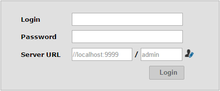
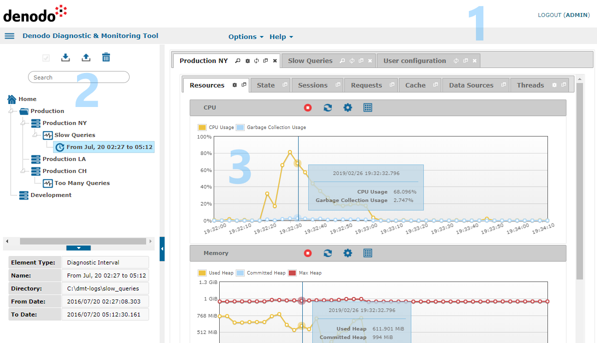
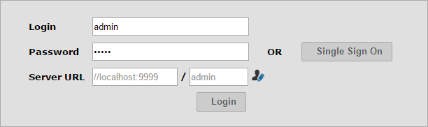

.. _dmt-authentication-authorization:

================================
Authentication and Authorization
================================

To access the Denodo Diagnostic & Monitoring Tool from the local
machine, connect to http://localhost:9090/diagnostic-monitoring-tool.
You will see the login dialog, as shown in `Authentication dialog in the
Diagnostic & Monitoring Tool`_.

   Authentication dialog in the Diagnostic & Monitoring Tool

Before clicking “Login”, you can click the icon |image1| to change the
database that will be used to check your credentials. Your user account
must have the ``CONNECT`` privilege on this database.

The credentials introduced in the login dialog are reused in the
communications with the Diagnostic & Monitoring Virtual DataPort when
you perform a diagnostic intervention. All the diagnostic-related
metadata is stored in the same database. The Diagnostic & Monitoring
Tool creates the diagnostic database the first time you
:ref:`create a diagnostic <Creating Diagnostics>`,
so make sure you use an administrator user of the
Diagnostic & Monitoring Virtual DataPort. Next time you want to create a
diagnostic, you only need a user with the ``ADMIN`` privilege on the
diagnostic database.

A user is considered an administrator of the Diagnostic & Monitoring Tool if she
is granted with the ``diagnostic_monitoring_tool_admin`` role. The administrator
is the only user who can change the :ref:`server configuration
<Server Configuration>` of the tool.

Once you successfully log in the Diagnostic & Monitoring Tool, you will
access to the main window.

   Main window of the Diagnostic & Monitoring Tool

This window is divided into three areas:

#. **Header**: You will find here the logout link and, under the Options
   menu, the :ref:`configuration <dmt-configuration>` of the tool.

#. **Tree area**: Here you can
   :ref:`create servers or environments <Creating Servers and Environments>` to monitor,
   :ref:`load diagnostic information or create diagnostic intervals <Creating Diagnostics and Diagnostic Intervals>` on it and
   :ref:`import or export <Export and Import>` the whole environment. At
   the bottom, you can unfold a menu with extra information about the
   selected node.

#. **Working area**: the data you are :doc:`/vdp/dmt/monitoring/monitoring` or
   :ref:`diagnosing <Diagnosing>` is presented here organized by tabs.

.. _dmt_admin_guide_authentication_and_authorization_kerberos_authentication:

Kerberos Authentication
=======================

The Diagnostic & Monitoring Tool supports Single Sign-On using the Kerberos
protocol. To enable Kerberos authentication in the Diagnostic & Monitoring Tool,
you have to:

#. Perform the post-installation tasks described in the section :ref:`Setting-up
   Kerberos Authentication` of the Installation Guide.

#. Enable Kerberos in the Diagnostic & Monitoring Virtual DataPort Server, as
   described in the section :ref:`Setting-Up the Kerberos Authentication in the
   Virtual DataPort Server` of the Virtual DataPort Administration Guide.

#. `Configure Kerberos in your browser
   <https://www.oracle.com/technetwork/articles/idm/weblogic-sso-kerberos-1619890.html>`_.

.. note:: Provide an absolute path when you enter the path to the keytab file in
   the Kerberos configuration of the Diagnostic & Monitoring Virtual DataPort
   Server.

If Kerberos authentication is properly configured, the Diagnostic & Monitoring
Tool will automatically authenticate you and show you its home page.

   Authentication dialog with Single Sign-On in the Diagnostic & Monitoring Tool

.. important:: To access the Diagnostic & Monitoring Tool Server, remember to
   use the Fully Qualified Domain Name of the Server Principal Name you
   configured in the Diagnostic & Monitoring Virtual DataPort Server. For
   example, if your Server Principal Name is
   ``HTTP/denodo-prod.subnet1.contoso.com@CONTOSO.COM``, you should access the
   Diagnostic & Monitoring Tool through the URL
   ``http://denodo-prod.subnet1.contoso.com:9090/diagnostic-monitoring-tool`` or ``https://denodo-prod.subnet1.contoso.com:9443/diagnostic-monitoring-tool``.

