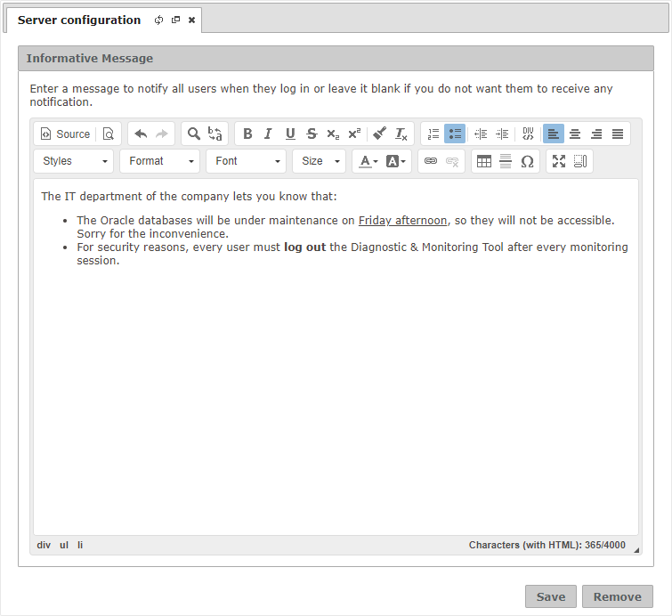
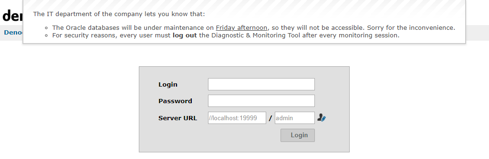

====================
Server Configuration
====================

To open the server configuration dialog, the user needs to click on **Options**
> **Server configuration**. This option is only available to administrator users
of the Diagnostic & Monitoring Tool.

A normal user in the Diagnostic & Monitoring Virtual DataPort server is promoted
to administrator of the Diagnostic & Monitoring Tool when she is granted with
the ``diagnostic_monitoring_tool_admin`` role.

Nowadays there is only one parameter that an administrator can change that will
affect the server behavior: the informative message.

Informative Message
===================

You can configure the Diagnostic & Monitoring Tool to show an informative
message every time a user accesses the tool. This message can address several
purposes: legal notice, welcome message, policy update...

The informative message consists of a piece of HTML to be rendered on the login
page. It supports most of the tags of the HTML language, so you can give the
text some structure and format.

.. note:: For security reasons, there are some limitations on the tags or
          attributes you can use in the informative message. For example,
          ``script`` tags are not available.

To help you create the informative message, the dialog includes an HTML editor
so you can graphically compose your text. Note that there is a limit of 4000
characters on the HTML text you can add as informative message. In case you have
an HTML text you would like to paste in the dialog, you need to go the
**Source** mode. Otherwise, the HTML tags will be escaped by the editor.

   Informative message dialog

After saving the informative message, the Diagnostic & Monitoring Tool will
display it to every user that tries to log in, like in the figure below.

   Informative message dialog at login page
