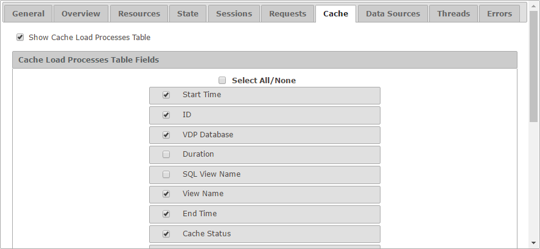

=====================
Configuration - Cache
=====================

The “Cache” tab allows you to
configure how looks like the “Cache” tab for both monitoring and
diagnostic.

   Cache tab of the configuration

The setting **Show Cache Load Processes Table** enables or disables the
tab itself. If selected, you can choose which fields appear by default
in the table and in which order.
