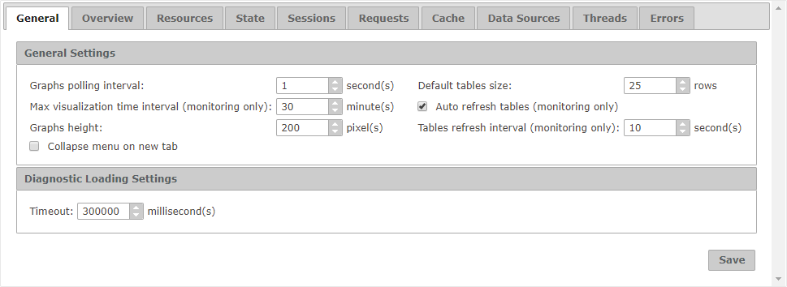

=======================
Configuration - General
=======================

The “General” tab displays
all the settings that affect all the tables and graphs of the Diagnostic
& Monitoring Tool.

   General tab of the configuration

The options in the “General Settings” section are:

-  **Graphs polling interval**: Number of seconds between two polls for
   new data in monitoring graphs.
-  **Max visualization time interval**: Default value for the option
   “Max visualization time interval” of monitoring graphs, which
   establishes the maximum number of minutes can pass between the first
   and the last measures until the graph starts discarding data.
-  **Graphs height**: Height in pixels of the graphs.
-  **Collapse menu on new tab**: If selected, collapses the lateral menu
   with the tree area every time you open a new tab in the working area.
-  **Default tables size**: Number of rows the tables will show at
   maximum. It establishes the default value for the “Count” parameter
   of the tables with pagination, or the “Max Rows” parameter of the
   tables that hold historical data.
-  **Tables max height**: Maximum height in pixels of the tables.
-  **Auto refresh tables**: If selected, monitoring tables will
   automatically refresh its content by default.
-  **Tables refresh interval**: Default value for the option “Refresh
   interval” of the monitoring tables, which establishes how often the
   tables are refreshed.

Loading a new diagnostic in the Tool is a process that can last a long
time, depending on the size of the logs. The setting **Timeout** in the
“Diagnostic Loading Settings” sets the maximum time in milliseconds a
diagnostic creation can last before the Tool considers it has failed.

