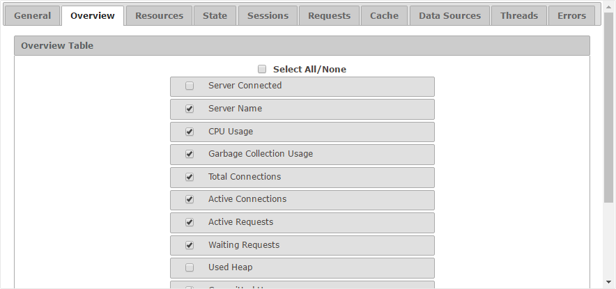

========================
Configuration - Overview
========================

The “Overview” tab allows
you to select which fields appear by default in the overview table and
in which order.

   Overview tab of the configuration

