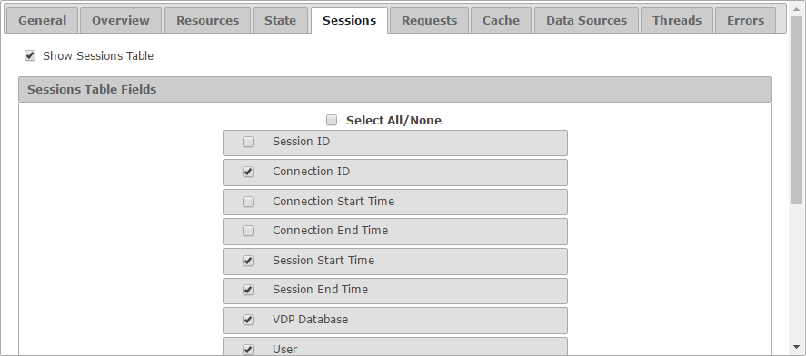

========================
Configuration - Sessions
========================

The “Session” tab allows you
to configure how looks like the “Session” tab for both monitoring and
diagnostic.

   Session tab of the configuration

The setting **Show Sessions Table** enables or disables the tab itself.
If selected, you can choose which fields appear by default in the table
and in which order.

