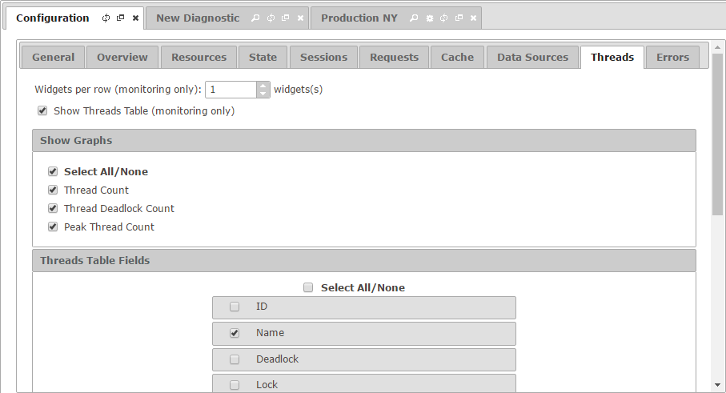

=======================
Configuration - Threads
=======================

The “Threads” tab allows you
to configure how looks like the “Threads” tab for both monitoring and
diagnostic.

   Threads tab of the configuration

The setting **Widgets per row** establishes how many elements are
arranged per row in the “Threads” tab of a monitored server.

The section “Show Graphs” allows you to select which series are
available in the graphs of the “Threads” tab. Those values that are
cleared will not be visible.

In the section “Threads Table Fields”, you can choose which fields
appear by default in the table and in which order.

