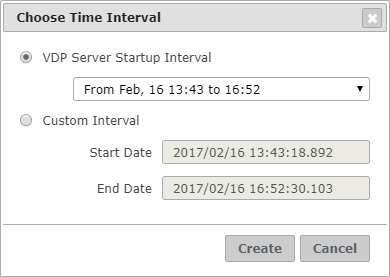
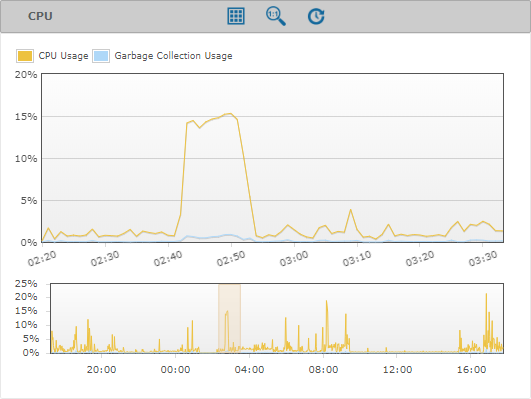

=============================
Creating Diagnostic Intervals
=============================

A diagnostic interval allows you to filter the information in all the
logs by a certain range of time. Only the diagnostic information that
was relevant during that interval will be displayed to you.

There are two ways to create a diagnostic interval:

#. In the tree area, right-click on an existent diagnostic |diagnostic|
   and click **Create Diagnostic Interval...** You will see the dialog of
   the figure below. You can select a predefined interval or enter the dates
   that define the interval and then click **Create**. The predefined intervals
   are built from the startup dates of the Virtual DataPort Server found in
   the logs.

   Dialog to create a new diagnostic interval

2. In any graph of an open diagnostic or diagnostic interval, you can
   select a region by dragging with the mouse in order to zoom in on
   that region. To
   create a new diagnostic interval in that region, click on the |diagnostic-interval|
   icon on the header of the graph and accept the confirmation dialog.

   A graph in diagnostic with a selected region

A new diagnostic interval will appear in the tree area, under the
corresponding diagnostic, represented with the |diagnostic-interval| icon.

