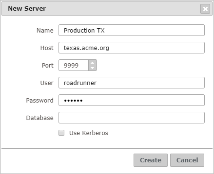

.. _dmt-creating-servers:

================
Creating Servers
================

A server contains the required information to connect to a Virtual
DataPort server through JMX. It is represented in the tree area with the
|server| icon.

There are two ways to create a server:

#. In the **Options** menu, click **New Server**.

#. Or in the tree area, right-click on |home| or on an environment |folder| and click
   **New Server...**.

The Diagnostic & Monitoring Tool will open the dialog below. Fill the form and
click **Create**.

   Dialog to create a new server

The Tool will use the credentials and the database you enter to create the JMX connection
to Virtual DataPort. If the database is not set, the Tool sends ``admin`` by default. This user
account needs to meet these conditions:

-  Be an administrator user.
-  Or have the ``jmxadmin`` role and the ``CONNECT`` privilege over the database
   specified in the *Database* field of the *New Server* dialog (or over the
   ``admin`` database if the database is not indicated). The Tool requires this
   privilege because it connects to the database to obtain the
   :ref:`i18n settings <Configuring the Default Internationalization>`
   of the Virtual DataPort server.

.. note:: To connect to the server using an LDAP user, you have to set the
   *Database* field to a Virtual DataPort database configured with LDAP authentication.

.. note:: If you want to connect to the server using Kerberos authentication,
   you still need to provide valid values for the user and password fields.
   Although you have logged in the Diagnostic & Monitoring Tool using
   :ref:`Single Sign-On <dmt_admin_guide_authentication_and_authorization_kerberos_authentication>`,
   your credentials are not reused when monitoring a server.

