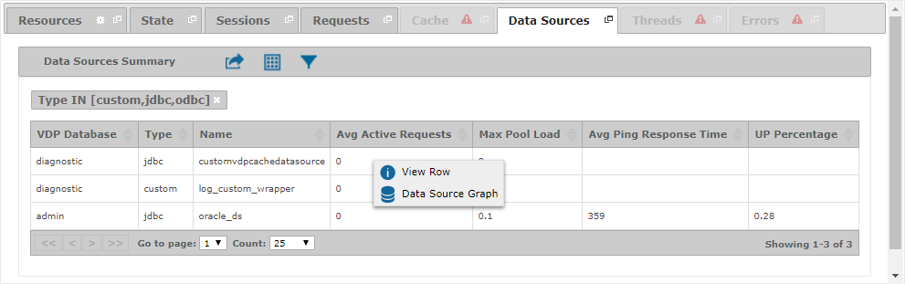
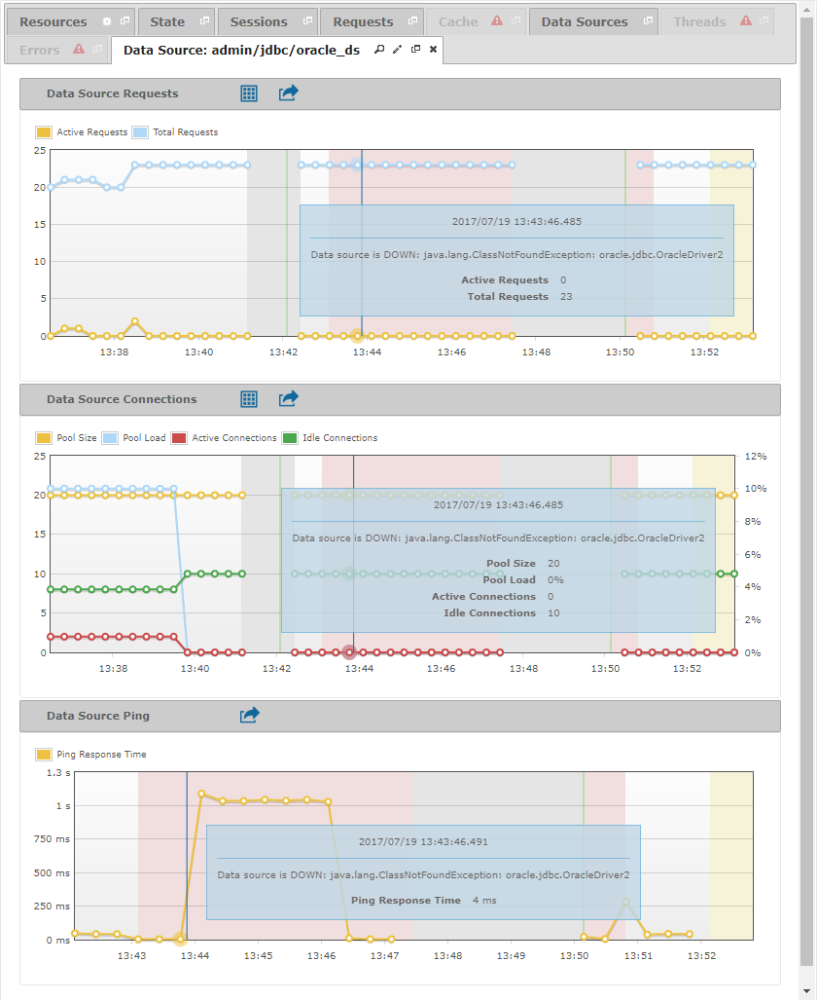
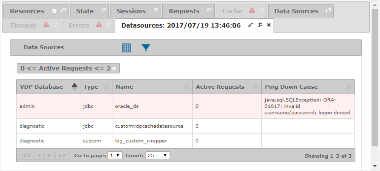

=========================
Diagnosing - Data Sources
=========================

The “Data Sources” tab displays the “Data Sources Summary” table, which
contains statistical information about the data sources defined in the
Virtual DataPort server. This information depends on the data source type:

-  Statistics about the connections pool are only available for ``JDBC`` and ``ODBC`` data sources.
-  Statistics about the ping response are only available for data sources ``JDBC``, ``ODBC``, ``LDAP``, ``OLAP``, ``SAPBWBAPI``,
   ``SAPERP`` and ``SALESFORCE``.

   Data Sources tab of a diagnostic or diagnostic interval

The fields that are available in the “Data Sources Summary” table are:

-  **VDP Database**: Name of the Virtual DataPort database that the data source belongs to.
-  **Type**: Type of the data source.
-  **Name**: Name of the data source.
-  **Max Active Requests**: Maximum number of simultaneous requests to the data source.
-  **Min Active Requests**: Minimum number of simultaneous requests to the data source.
-  **Avg Active Requests**: Average number of concurrent requests to the data source.
-  **Max Total Requests**: Maximum number of requests to the data source processed since the launch of the Virtual
   DataPort server.
-  **Min Total Requests**: Minimum number of requests to the data source processed since the launch of the Virtual
   DataPort server.
-  **Avg Total Requests**: Average number of requests to the data source processed since the launch of the Virtual
   DataPort server.
-  **Max Active Connections**: Maximum number of active connections in the pool. An empty value means there is no pool.
-  **Min Active Connections**: Minimum number of active connections in the pool. An empty value means there is no pool.
-  **Avg Active Connections**: Average number of active connections in the pool. An empty value means there is no pool.
-  **Max Idle Connections**: Maximum number of inactive connections in the pool. An empty value means there is no pool.
-  **Min Idle Connections**: Minimum number of inactive connections in the pool. An empty value means there is no pool.
-  **Avg Idle Connections**: Average number of inactive connections in the pool. An empty value means there is no pool.
-  **Max Pool Size**: Maximum size of the connections pool. An empty value means there is no pool.
-  **Min Pool Size**: Minimum size of the connections pool. An empty value means there is no pool.
-  **Avg Pool Size**: Average size of the connections pool. An empty value means there is no pool.
-  **Max Pool Load**: Maximum percentage of connections in the pool that are active. An empty value means there is no pool.
-  **Min Pool Load**: Minimum percentage of connections in the pool that are active. An empty value means there is no pool.
-  **Avg Pool Load**: Average percentage of connections in the pool that are active. An empty value means there is no pool.
-  **Max Ping Response Time**: Maximum response time in milliseconds of ping requests.
-  **Min Ping Response Time**: Minimum response time in milliseconds of ping requests.
-  **Avg Ping Response Time**: Average response time in milliseconds of ping requests.
-  **UP Percentage**: Percentage of ping requests whose result was ``UP``.
-  **DOWN Percentage**: Percentage of ping requests whose result was ``DOWN``.
-  **TIMEOUT Percentage**: Percentage of ping requests whose result was ``TIMEOUT``.

You can right-click on a data source and click |data-source| **Data Source Graph** to open a new tab with some graphs that
present the historical evolution of the collected data for that data source. According to the data present in the logs,
this tab may include several of the following graphs:

*  **Data Source Requests**: Information about the requests addressed by the data source. It is always present.
*  **Data Source Connections**: Information about the connections pool. It is only available for ``JDBC`` and ``ODBC``
   data sources.
*  **Data Source Ping**: Information about the response time of ping requests. It is only present when there is ping
   information available for the data source.

When the logs contain ping information, these graphs may be decorated with red and yellow regions, which show the
intervals when the data source was down or the ping could not be resolved because of a timeout, respectively. You can
pass the mouse over the red regions to consult the error that caused the data source was down.

   Data Source tab with the evolution of its data presented as graphs

Furthermore, you can obtain the state of the data sources at a specific date. You can get this in two different ways:

#. In the :ref:`“Data Sources Summary” table <Data Sources tab of a
   diagnostic or diagnostic interval>`, click the icon |details|
   located at the header. A dialog will appear asking for the date.
   Enter a date and click **View Data Sources**.

   .. figure:: MonitoringAndDiagnosticTool-127.png
      :align: center
      :alt: Dialog to obtain the data sources at a specific date
      :name: Dialog to obtain the data sources at a specific date

      Dialog to obtain the data sources at a specific date

2. In any of the graphs that show the :ref:`historical evolution for a
   particular data source <Data Source tab with the evolution of
   its data presented as graphs>`, you can select a date by clicking on
   the graph. Then, click on the icon |details| located at the header of the graph.

As a result, a new tab will appear with the
state of all the data sources at the selected date.

   Data Sources tab with the state of the data sources at a specific date

You can find a detailed explanation of the measures in the graphs and
the fields in the table on the section :ref:`Monitoring - Data Sources`.

.. |details| image:: ../../common_images/export.png
