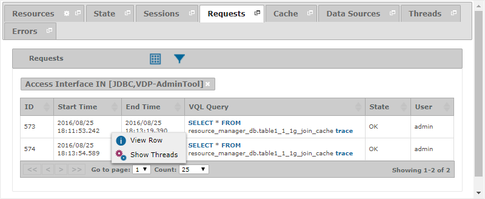
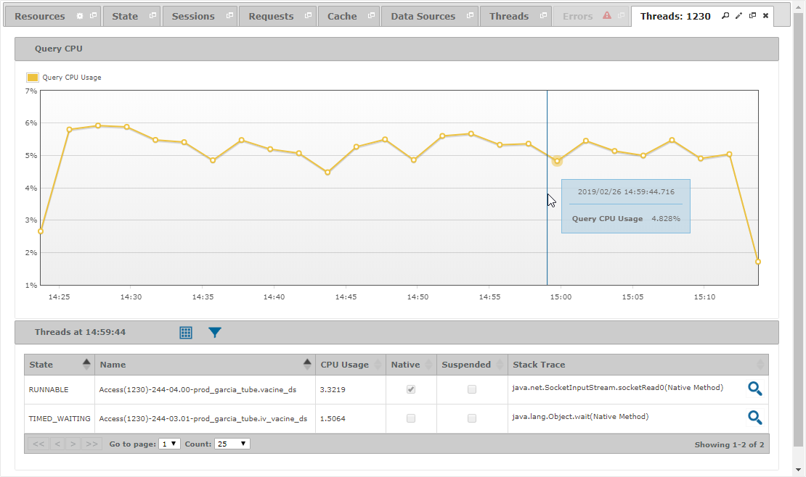

=====================
Diagnosing - Requests
=====================

The “Requests” tab displays information about the requests processed by the
Virtual DataPort server.

   Requests tab of a diagnostic or diagnostic interval

Notice that you can define filters using both the fields of a request
and the fields of its corresponding session.

To see information about the threads that were involved in the execution
of a query, right-click on the query and click |tools| **Show Threads**.
A new tab will open with a graph showing the evolution of the query CPU and
a table with its threads at a specific date. By clicking on the graph, you can
select the nearest instant with information and change the snapshot of the query
threads shown in the table below.

   Threads tab of a request

You can find a detailed explanation of the fields in the “Requests”
table on the section :ref:`Monitoring - Requests`.

