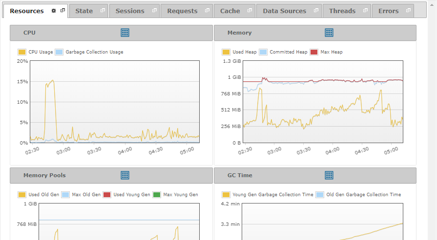

======================
Diagnosing - Resources
======================

The “Resources” tab displays the status of the resources of the Virtual DataPort
server: CPU, memory and garbage collector.

   Resources tab of a diagnostic or diagnostic interval

You can collapse or expand all the graphs in the “Resources” tab by
clicking on |image1| or |image2|, respectively. These options will
appear when you click on the |image3| icon of the tab.

You can find a detailed explanation of the measures in these graphs on
the section :ref:`Monitoring - Resources`.

.. |image1| image:: ../../common_images/up.png
.. |image2| image:: ../../common_images/down.png
.. |image3| image:: ../../common_images/tool_black.png
