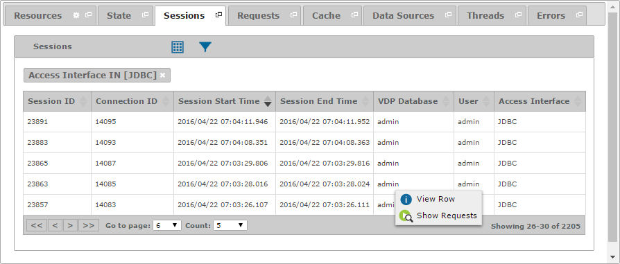

=====================
Diagnosing - Sessions
=====================

The “Sessions” tab displays the opened connections and sessions to the Virtual
DataPort server.

   Sessions tab of a diagnostic or diagnostic interval

To open a new tab with the requests of a session, right-click on it and
click |image1| **Show Requests**.

You can find a detailed explanation of the fields in the “Sessions”
table on the section :ref:`Monitoring - Sessions`.

