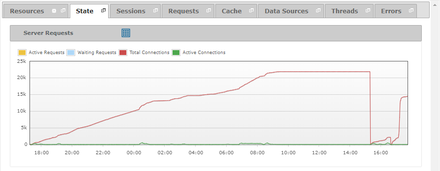

==================
Diagnosing - State
==================

The “State” tab displays the connections and requests managed by the Virtual
DataPort server.

   State tab of a diagnostic or diagnostic interval

You can find a detailed explanation of the measures in this graph on
the section :ref:`Monitoring - State`.

