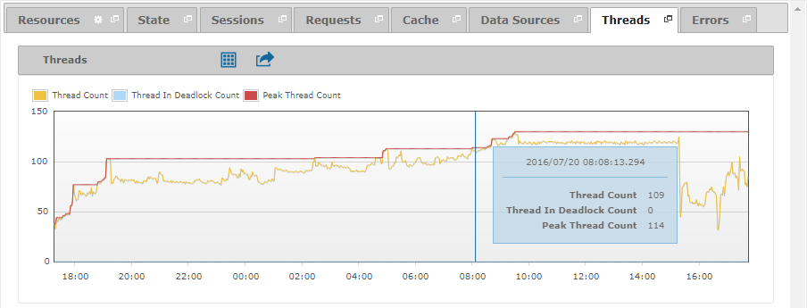
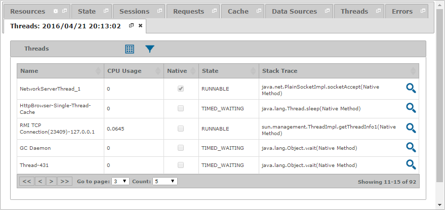

====================
Diagnosing - Threads
====================

The “Threads” tab displays a graph with historical information about the
number of threads in the Virtual DataPort server.

   Threads tab of a diagnostic or diagnostic interval

To obtain more information about the threads, select a date in the graph
by clicking on it and then click on the |details| icon located at the
header. As a result, a new tab will appear with the state of the threads
at the selected date. If the Virtual DataPort server was stuck in a
deadlock at this date, you will see the |warning| icon on the header of
the table and the threads involved in the deadlock will be highlighted
in red.

   Threads tab with the state of the threads at a specific date

You can find a detailed explanation of the measures in the graph and the
fields in the table on the section :ref:`Monitoring - Threads`.

