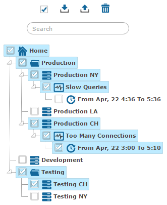
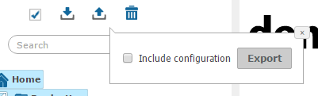
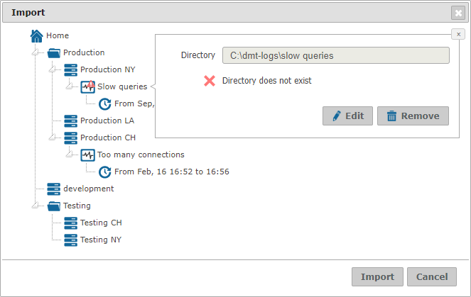
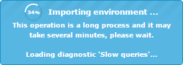

=================
Export and Import
=================

This section explains how to export the metadata of the Diagnostic &
Monitoring Tool server for the current user. It can be helpful for
backup purposes or to re-create the same metadata in another server.
This metadata includes both the definition of the elements in the tree
area and the configuration.

.. contents::
   :depth: 1
   :local:
   :backlinks: none

Export
======

To export the user information, you must select first which elements in
the tree area will be saved. The tree area supports a multiple selection
mode that is controlled by the check box on the top. If this check box is
disabled |image0|, you will export all the elements in the tree area.
Click on it to enable it |image1| and activate the multiple selection
mode so you can select
only those elements that you want to export. Take into account that to
export a node you must select all its parents until the node |image2|.

   Tree area in multiple selection mode

Once you have selected which nodes to export, click on |image4| to show
the export dialog. Select the **Include
configuration** to export the user configuration and then click
**Export**. The Tool will generate a file with all the user metadata
that you have selected.

   Export dialog

Import
======

To import the metadata of a user, click on |import|, choose a file from
your local machine and then click **Upload**. The import dialog will
appear and show all the information that is available in the file to import.

You can click on every node to check its definition or discard it from the
import. If there is a diagnostic that cannot be imported with the current
configuration, it will appear as |diagnostic-warning|. To check which is the
underlying problem, just click on the node. In addition, you can edit the
diagnostic definition, changing the directory where the logs reside or the
server, in case the directory contains logs from more than one server.

.. note:: Remember that the path of a diagnostic points to a directory in the
   machine where the Diagnostic & Monitoring server is running.

When you have finished configuring the import, click **Import**.

   Import dialog

If the import includes some diagnostics, they have to be loaded in the
system one by one, which may be a long process. If that is the case, a
new dialog will open with information about the progress of the import.

   Dialog with information about the progress of an import

.. |image2| image:: ../common_images/home.png

.. |import| image:: ../common_images/download.png

