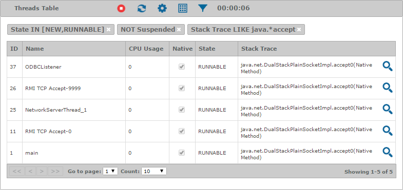

==========
Monitoring
==========

.. toctree::
   :hidden:

   monitoring_servers/monitoring_servers.rst
   monitoring_environments/monitoring_environments.rst
   overview/overview.rst

The goal of monitoring is to be aware of the state of your Virtual
DataPort servers in real-time and detect malfunctions as soon as
possible so you can take action to solve them.

The Diagnostic & Monitoring Tool displays the status of the Virtual
DataPort servers using graphs and tables that are updated every few
seconds.

You can visualize with graphs the resources information of a monitored server,
for instance, like in the figure below.

   Monitoring information presented with graphs

Discovering the actual values in the graphs is as easy as moving the mouse over
a graph. Graphs are synchronized, so you can track all their series data at
once. You only need to move the mouse over one of the graphs, and a tooltip will
appear in all the visible graphs showing the values for their measures at that
instant. You can click on a graph and the tracking will freeze, ignoring the
mouse movement, so you can inspect the frozen instant for all the graphs. Click
again, and the tracking will resume. In addition, if the series points are
visible, graphs will highlight which points are considered for the tracking.

For each graph, its header contains its name and a set of icons to operate with
it:

-  |stop|: Pauses obtaining new monitoring data.

-  |play|: Resumes obtaining new data, so the graph updates the
   information at a certain interval. You can change
   :ref:`how often the data is refreshed <Configuration - General>`.

-  |reload|: Removes the current data from the graph.

-  |tool|: Unfolds a menu with the following option to configure the graph:

   -  **Max visualization time interval**: Maximum number of minutes can
      pass between the first and the last measures until the graph starts
      discarding data. The graph will discard those measures that are older
      than this value.

-  |grid|: Displays a menu where you can choose which series the graph
   will display.

The figure below shows an example of
monitoring information displayed as a table. As with the graph, the
header shows the name of the table and a set of icons to operate with
it. You can click on the header and the table will collapse.

   Monitoring information presented in a table

The icons in the header of a table are:

-  |stop|: Stops refreshing the table.
-  |play|: Starts refreshing the table. The countdown in the header of
   the table shows the time until the next refresh.
-  |reload|: Forces a refresh of the table.
-  |tool|: Unfolds a menu with the following options:

   -  **Refresh interval**: Number of seconds between automatic refreshes
      of the content of the table.
   -  **Max rows**: For the tables that hold historical data, maximum
      number of rows of the table.
-  |grid|: Displays a menu where you can choose which fields the table
   will display.
-  |filter|: Displays a dialog to define a condition to filter the
   contents of the table. Depending on the type of the field selected, the
   type of condition is different:

   -  ``MIN-MAX``: Applied to numbers or dates, it sets the minimum and/or
      maximum value the field can take.

      .. figure:: MonitoringAndDiagnosticTool-29.png
         :align: center
         :alt: Dialog of a MIN-MAX filter
         :name: Dialog of a MIN-MAX filter

         Dialog of a ``MIN-MAX`` filter

   -  ``IN``: Applied to enumerated values, this filter defines a set of values
      with which to compare the field. You have to click on the |plus| icon to add a value to the
      set or click on its |remove| icon
      to remove it. The field must be equal to one of the values in the set to
      pass the filter.

      .. figure:: MonitoringAndDiagnosticTool-32.png
         :align: center
         :alt: Dialog of an IN filter
         :name: Dialog of an IN filter

         Dialog of an ``IN`` filter

   -  ``TRUE-FALSE``: Applied to boolean values, this filter checks if the
      field is true or false, according to the value that is selected.

      .. figure:: MonitoringAndDiagnosticTool-33.png
         :align: center
         :alt: Dialog of a TRUE-FALSE filter
         :name: Dialog of a TRUE-FALSE filter

         Dialog of a ``TRUE-FALSE`` filter

   -  ``LIKE``: Applied to texts, this filter sets the value with which to
      compare the field. If **Exact** is selected, the whole text must be
      equal to this value to pass the filter. When cleared, the value is
      interpreted as a regular expression and only a substring of the text
      must match it to satisfy the filter.

      .. figure:: MonitoringAndDiagnosticTool-34.png
         :align: center
         :alt: Dialog of a LIKE filter
         :name: Dialog of a LIKE filter

         Dialog of a ``LIKE`` filter

Double-click on a row, or right-click and select |info| **View Row**,
to see all its fields. This is useful if you configured the table
to display only some fields.

   The information dialog shows the values for all the fields of a row

Some tabs have the |tab-tool| icon, which unfolds a menu with the
following options:

-  |up|: Collapses all the graphs and tables in the tab.
-  |down|: Expands all the graphs and tables in the tab.
-  |play|: Starts the monitoring of the graphs and tables in the tab.
-  |stop|: Stops the monitoring of the graphs and tables in the tab.

.. |play| image:: ../common_images/play.png

.. |info| image:: ../common_images/info.png

.. |up| image:: ../common_images/up.png

