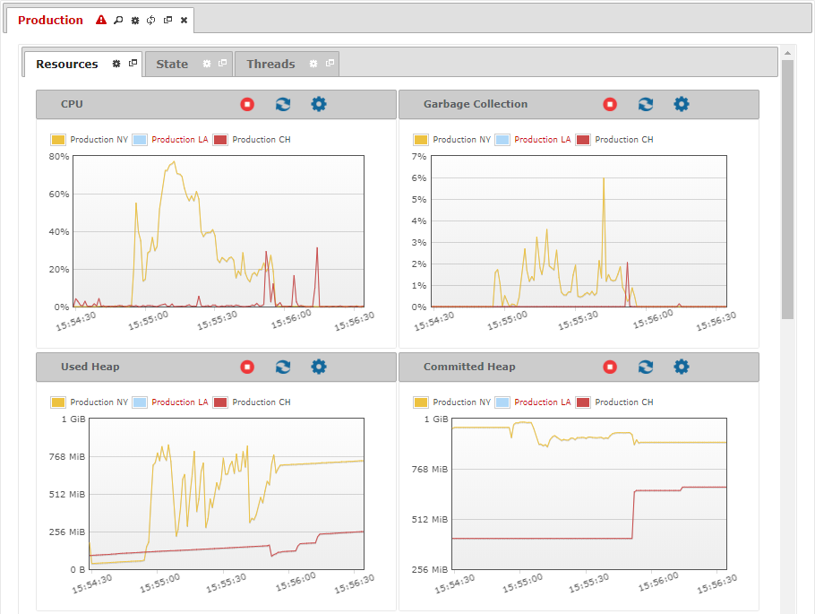

=======================
Monitoring Environments
=======================

To monitor all the Virtual DataPort servers of an environment,
double-click the environment in the tree area. The Tool will open a new
tab with real-time information of the servers of this environment.

   Monitoring an environment

To monitor an environment, the Tool requires that all its Servers have
the same time zone according to their
:ref:`default i18n <Configuring the Default Internationalization>`.

The monitoring of an environment displays as graphs the management
information of several servers at once. The information available is the
same that you can obtain in the graphs for each individual server, but
organized in a different way. Each graph represents a different measure
and the series for each graph are the servers in the environment, so you
can easily compare how they behave.

There are a set of icons located at the tab of a monitored environment:

-  |magnifying-glass|: Shows information about the monitored environment.
-  |tab-tool|: Unfolds a menu with the options |play|, to start the monitoring of all the servers, and |stop|, to stop it.
-  |reload|: Reloads the whole tab restarting the monitoring of all the servers. The existing data will be lost.
-  |detach|: Opens the tab in a new window.
-  |close|: Closes the tab and stops monitoring those servers.
-  |warning|: Warns that the Tool cannot connect to one of the Servers of the environment. Click on this icon to see which server is unreachable. This icon will disappear as soon as the tool can successfully connect to all the servers of the environment. Meanwhile, the graphs will not show any information for the unreachable servers.

.. |tab-tool| image:: ../../common_images/tool_black.png
.. |play| image:: ../../common_images/play.png
.. |stop| image:: ../../common_images/stop.png

.. |warning| image:: ../../common_images/warning.png
            :scale: 75 %

