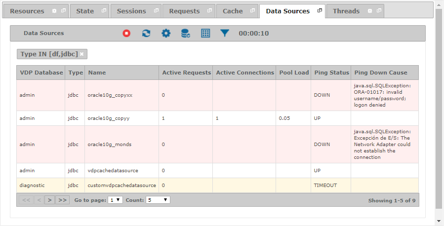
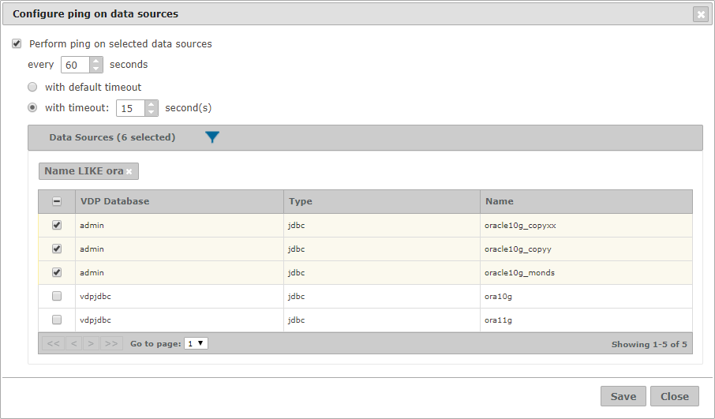

=========================
Monitoring - Data Sources
=========================

The “Data Sources” tab displays information about the data sources defined in the Virtual DataPort server. This
information depends on the data source type:

-  Information about the pool connections is only available for ``JDBC`` and ``ODBC`` data sources.
-  Information about the ping response is only available for ``JDBC``, ``ODBC``, ``LDAP``, ``OLAP``, ``SAPBWBAPI``,
   ``SAPERP`` and ``SALESFORCE`` data sources.

   Data Sources tab of a monitored server

You can filter the results of this table by defining conditions over its data.

The fields that are available in the “Data Sources” table are:

-  **VDP Database**: Name of the Virtual DataPort database that the data source belongs to.
-  **Type**: Type of the data source.
-  **Name**: Name of the data source.
-  **Active Requests**: Number of active requests being currently executed on the data source.
-  **Total Requests**: Total number of requests to the data source processed since the launch of the Virtual DataPort
   server.
-  **Active Connections**: Number of connections established with the data source that are being used to execute a
   query. An empty value means there is no pool.
-  **Idle Connections**: Number of inactive connections in the pool. An empty value means there is no pool.
-  **Pool Size**: Maximum number of connections in the pool. An empty value means there is no pool.
-  **Pool Load**: Percentage of connections in the pool that are active. An empty value means there is no pool.
-  **Ping Status**: Status of the data source after a ping request, which can take one of the following values: ``UP``,
   ``DOWN`` and ``TIMEOUT``.
-  **Ping Response Time**: Response time in milliseconds of the data source to a ping request.
-  **Ping Execution Time**: Moment at which the ping was performed.
-  **Ping Down Cause**: In case the data source is ``DOWN``, the error captured when the ping was performed.

Ping Data Sources
=================

The Diagnostic & Monitoring Tool can perform periodic ping requests on a group of data sources to monitor their current
status.

Click on the |configure_ping| icon to open the configuration dialog below.

   Dialog to configure ping on data sources

You can configure the period of the ping requests, a different timeout from the one defined in Virtual DataPort and the
list of data sources to be pinged. Note that you can easily select the list of data sources by filtering the contents of
the table.

Once you save your configuration, the Diagnostic & Monitoring Tool will start to perform periodic ping requests. This
configuration will be persisted, so future monitoring sessions of the server will also perform ping requests on the
selected data sources.

Those data sources that are actively monitored will update their ping-related fields in real time. Besides, their rows
will be painted accordingly:

-  Data sources with status as ``DOWN`` are displayed in red.
-  Data sources with status as ``TIMEOUT`` are displayed in yellow.

