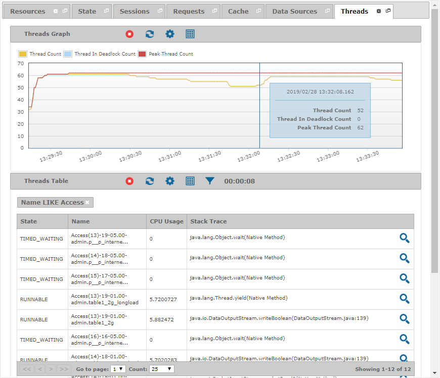

====================
Monitoring - Threads
====================

The “Threads” tab displays
information about the threads of the Virtual DataPort server.

   Threads tab of a monitored server

The graph displays historical information about the number of threads in
the Virtual DataPort server. The actual measures it displays are:

-  **Thread Count**: Number of live threads in the JVM.
-  **Thread In Deadlock Count**: Number of threads in a deadlock.
-  **Peak Thread Count**: Maximum number of live threads since the JVM
   started.

The table lists the current live threads. You can define conditions to
filter the results of this table.

If there is a deadlock between two or more threads of the Virtual
DataPort server, the Tool will display the icon |image0| in the header
of the table and the affected threads will be highlighted in red.

The fields that are available in the “Threads” table are:

-  **ID**: Unique identifier of the thread.
-  **Name**: Name of the thread.
-  **Deadlock**: ``true`` if the thread is deadlocked in a cycle waiting
   for a lock; ``false`` otherwise. A thread is deadlocked in a cycle if
   each thread owns one lock while trying to acquire another lock
   already held by another thread in the cycle.
-  **Lock**: Object on which the thread is blocked.
-  **Lock Owner ID**: Identifier of the thread that owns the object for
   which the thread is blocked waiting. This method will return ``-1``
   if this thread is not blocked waiting for any object or if the object
   is not owned by any thread.
-  **Lock Owner Name**: Name of the thread that owns the object for
   which the thread is blocked waiting. This method will return ``null``
   if this thread is not blocked waiting for any object or if the object
   is not owned by any thread.
-  **CPU Time**: Actual CPU time (in nanoseconds) for this thread.
-  **Previous CPU Time**: CPU time (in nanoseconds) for this thread
   obtained in the previous interval.
-  **Elapsed CPU Time**: Difference between the CPU time for this thread
   in the present interval and the CPU time obtained in the previous
   interval (in nanoseconds).
-  **Elapsed Time**: Elapsed time between now and the time that the
   previous interval ended (in milliseconds).
-  **CPU Usage**: Estimated CPU usage for this thread.
-  **Native**: ``true`` if the thread is executing native code via the
   Java Native Interface (JNI); ``false`` otherwise.
-  **Suspended**: ``true`` if the thread is suspended; ``false``
   otherwise.
-  **State**: State of the thread, which can take one of the following
   values: ``NEW``, ``RUNNABLE``, ``BLOCKED``, ``WAITING``,
   ``TIMED_WAITING`` and ``TERMINATED``.
-  **Stack Trace**: Stack trace of the thread.

.. |image0| image:: ../../common_images/warning.png

