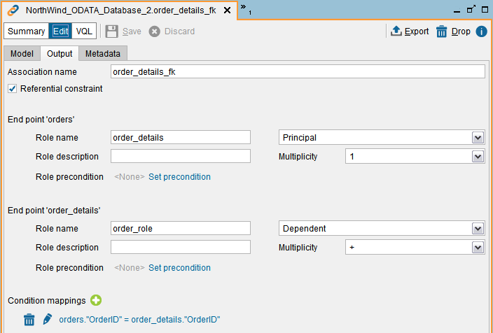

============
CATALOG_FKS
============

.. note:: This stored procedure is deprecated and it may be removed in the next
   major version of the Denodo Platform. Use the procedure :ref:`GET_FOREIGN_KEYS` instead of this one because "GET_FOREIGN_KEYS" can search on any database, not just in the one you are connected to and it returns the same information.

.. rubric:: Description

The stored procedure ``CATALOG_FKS`` returns the list of fields that
make up the foreign keys of a view, or of all the views the database you are connected to.

A foreign key is a field or set of fields that is used to establish a
link between the data of two views. In a foreign key reference, the
fields that hold the primary key value for one view are referenced by a
column or set of columns in another table.

To create a foreign key constraint in Virtual DataPort you have to
create an association between two views and mark it as a referential
constraint. The section :doc:`/vdp/administration/restful_architecture/associations/associations` of the Administration Guide
explains how to do it.

.. rubric:: Syntax

.. code-block:: bnf

   CATALOG_FKS (
       input_view_name : text
   )

-  ``input_view_name`` (optional): name of the view for which you want
   to obtain the list of fields that make up the foreign key. You need
   to be connected to the database of this view.

The procedure returns one row per field that makes up the foreign keys.
The output schema has the following fields:

-  ``pkdatabase_name``: database of the view at the other side of the
   foreign key relationship (i.e. in the “principal” side of the
   association).
-  ``pkview_name``: view at the other side of the foreign key
   relationship (i.e. in the “principal” side of the association).
-  ``pkcolumn_name``: field name of the primary key of the view at the
   other side of the foreign key relationship (i.e. in the “principal”
   side of the association).
-  ``fkdatabase_name``: database of the view with the foreign key. This
   is always the database that you are connected to.
-  ``fkview_name``: view with the foreign key.
-  ``fkcolumn_name``: name of the field of the foreign key.
-  ``fk_name``: name of the constraint. This is the name of the
   association.
-  ``pk_name``: name of the primary key. This is the name of the view at
   the other side of the foreign key relationship, followed by “\_pk”.
-  ``database_name``: name of the database that holds the association.
   An association can be stored in a different database than the views
   of the association.

.. rubric:: Privileges Required

The procedure only returns information about the views over which the
user has the Metadata privilege.

.. rubric:: Example

Let us say that you have defined:

#. The view ``order_details``: its primary key is made up of the fields
   ``order_id`` and ``order_line_id``. If you execute the following:
#. The view ``order``: its primary key field is ``OrderId``.
#. An association between these views like in the screenshot below:

..

   Only associations that are referential constraints (see check box on the top of the screenshot) are considered foreign key constraints.
   
   In this screenshot, ``orders`` is the principal side of the association and ``order_details``, the dependent. 
   That is because all the order details need to be linked to an order.
   
   The multiplicity of the end point ``order`` is 1, which means that each row of ``order_details``
   is linked to one and only one row of order. 
   
   The multiplicity of the end point ``order_details`` is +, which means that each row of ``order`` is 
   linked to one or more rows of ``order_details``.

If you execute the following query:
   
.. code-block:: sql

   SELECT pkdatabase_name, pkview_name, pkcolumn_name, fkdatabase_name, fkview_name
          , fkcolumn_name, fk_name, pk_name, database_name
   FROM CATALOG_FKS()
   WHERE input_view_name = 'order_details';

The result will be:

+----------------+----------------+----------------+----------------+----------------+
| pkdatabase\_na | pkview\_name   | pkcolumn\_name | fkdatabase\_na | fkview\_name   |
| me             |                |                | me             |                |
+================+================+================+================+================+
| admin          | orders         | OrderID        | admin          | order\_details |
+----------------+----------------+----------------+----------------+----------------+

+--------------------+--------------------+--------------------+--------------------+
| fkcolumn\_name     | fk\_name           | pk\_name           | database\_name     |
+====================+====================+====================+====================+
| OrderID            | order\_details\_fk | orders\_pk         | admin              |
+--------------------+--------------------+--------------------+--------------------+

(for visibility reasons, the columns are displayed in two tables)

