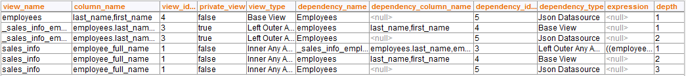

====================
COLUMN_DEPENDENCIES
====================

.. rubric:: Description

The stored procedure ``COLUMN_DEPENDENCIES`` returns a list of the
dependencies of one or more fields of a derived view.

This procedure allows you to obtain programmatically the same
information that the Administration Tool displays in the “Data lineage”
dialog of a derived view.

If you want to obtain the dependencies between views and you do not need the dependencies between fields, we recommend using the procedure :ref:`VIEW_DEPENDENCIES` instead of this one. Its output is simpler than the output of this procedure. 

.. rubric:: Syntax

.. code-block:: bnf

   COLUMN_DEPENDENCIES ( 
         input_view_database_name : text
       , input_view_name : text
       , input_column_name : text 
   )

-  ``input_view_database_name``: name of the database of the view.
-  ``input_view_name``: name of the view.
-  ``input_column_name`` (optional): name of the field you want to
   obtain its dependencies from. If ``null``, the procedure returns the
   dependencies of all the fields of the view.

Each row of the result of this procedure represents a dependency between
a field of the derived view “view\_name” and the field of another
element (“dependency name”), which can be a derived view, a base view or
a data source.

The output schema has the following fields:

-  ``view_database_name``: name of the database that the view on the field
   “view\_name” belongs to.

-  ``view_name``: name of the derived view.

-  ``column_name``: name of the column.

-  ``view_identifier``: identifier of the view. It is autogenerated by the
   stored procedure and may change between executions of the procedure. See
   the example below to understand how to use this value.

-  ``private_view``: ``true`` if the view on the field “view\_name” is
   private; ``false`` otherwise.

   A view is private when “view\_name” represents a join, minus, intersect
   view of another join/minus/intersect view and the view was internally created by
   Virtual DataPort and not by the user.
   
   For example, if you create a derived view called J\_V that joins three
   views: (V1 JOIN V2) JOIN V3, internally Virtual DataPort creates a join
   view of V1 and V2. J\_V will be the result of joining this internal view
   with V3. In this example, the join of V1 and V2 is a private view and
   J\_V is public.
   
   The information about private views allows you to know in which order a
   join/minus/intersect view of more than two views is performed.

-  ``view_type``: type of view. I.e. Base view, Select, Join, Interface,
   etc. When the type of the view is join, the value of this field includes
   the following information, in this order:

   -  Type of join: it can be “Inner”, “Left outer”, “Right outer” or “Full
      outer”.
   -  Join method: it can be “Any”, “Hash”, “Nested”, “Nested parallel” or
      “Merge”. “Any” means that the user did not select a method to execute
      the join when creating the view. Therefore, the Execution Engine will
      automatically select a method, unless one is selected in the
      “Execution plan” tab of the queried view.
   -  Order of the join: it can be “Any”, “Ordered” or “Reverseorder”.
      “Any” means that the user did not select an order to execute the join
      when creating the view. Therefore, the Execution Engine will
      automatically select an order, unless one is selected in the
      “Execution plan” tab of the queried view.

-  ``dependency_database_name``: name of the database that the dependency
   belongs to.

-  ``dependency_name``: name of the element (view or data source) on which
   the view on the “view\_name” field depends.

-  ``dependency_column_name``: name of the field on which the field on
   “column\_name” depends. The value of this field will be a
   comma-separated list of fields, *if* “column\_name” is the result of
   evaluating an expression that involves more than one field. The
   “expression” field of the same row will contain this expression.

-  ``dependency_identifier``: internal identifier of the element (view or
   data source) on which the view on the “view\_name” field depends. This
   number identifies the dependency between a derived view and another
   element. Therefore, all the rows that represent a dependency between a
   field of the view V1 and the view V2, will have the same
   “dependency\_identifier”.

   This identifier is autogenerated by the stored procedure and may change
   between executions of the procedure.

-  ``dependency_type``: type of the dependency element.

-  ``expression``: if not ``null``, it is the expression assigned to the
   field of the view (``column_name``).

-  ``depth``: distance between the view of the field “view\_name” and the
   dependency.

   When a row represents a direct dependency, the value of this field is
   ``1``. Direct dependencies are dependencies between views that directly
   depend on each other. E.g. a base view and a projection view created
   over this base view have a direct dependency.
   
   When a row represents a transitive dependency, the value of this field
   is greater than ``1``. Transitive dependencies are dependencies between
   views that depend on each other, but there are other views in between.
   Let us say that we have created a selection view called P\_V created
   over a base view BV1. In this example, there is a transitive dependency
   between P\_V and the data source of the view BV1.

.. rubric:: Example

Let us say that we have created a view called sales_info like this:
``sales_info`` like this:

(employees LEFT OUTER JOIN orders) INNER JOIN products

and that you have added a field to ``sales_info`` that is an expression:
the concatenation of the fields ``first_name`` and ``last_name`` of the
``employees`` table.

The following image is a screenshot of the result of executing

.. code-block:: sql

   SELECT * 
   FROM COLUMN_DEPENDENCIES ()
   WHERE input_view_database_name = 'customer_360'
       AND input_view_name = 'sales_info'
       AND input_column_name = 'employee_full_name';

For formatting purposes, some columns are not displayed.

   Sample result of executing the procedure ``COLUMN_DEPENDENCIES``

To understand the result, take into account the following:

-  The row #2 and #3 represent the dependencies of a private view (the
   field “private” is ``true`` in these rows). This private view is the
   left outer join between employees and orders.

-  The rows #4 till the last one describe the dependencies of the view
   ``sales_info``. Note that all of them have the same “view\_identifier”.
   All the dependencies of a view have the same “view\_identifier”.

-  The rows whose value of “dependency\_identifier” is 5 represent the
   direct or transitive dependencies with the JSON data source “Employees”:

   -  Row #1 represents the direct dependency between the base view
      “employees” and the JSON data source. The dependency is direct
      because the value of the “depth” field is ``1``.
   -  Row #3, the transitive dependency between the private view and the
      JSON data source. The dependency is transitive because “depth” is
      greater than ``1``.
   -  Row #6, the transitive dependency between the view “sales\_info” and
      the JSON data source. This dependency is also transitive because
      “depth” is ``2``.

-  In row #4, the value of the field “expression” is the expression
   assigned to the field “employee\_full\_name” of the view “sales\_info”.

.. rubric:: Privileges Required

The information returned by the procedure changes depending on the type
of user that executes the procedure:

-  Administrators: the procedure returns information about all the
   fields’ dependencies.
-  Administrators of a database: if the user is an administrator of the
   database of the input parameter “database name”, the procedure
   returns information about the fields of all the views of that
   database.
-  Users that have ``METADATA`` privileges over a database: the procedure
   returns information about the dependencies of the fields of all the
   views of that database. However, it does not return the dependencies
   between views and data sources.
-  Users that have ``METADATA`` privileges over some views of a database: the
   procedure returns information about the dependencies of the fields of
   the views on which the user has the ``METADATA`` privilege granted. If the
   user does not have ``METADATA`` privilege granted over the dependency, the
   value of the field “dependency\_type” will be “No Privileges”. It
   does not return the dependencies between views and data sources.

