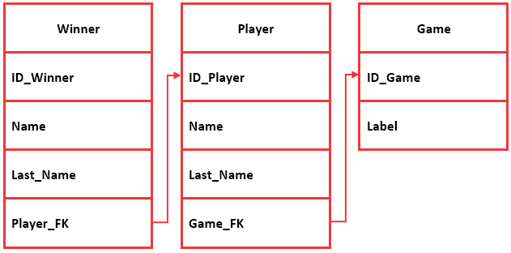
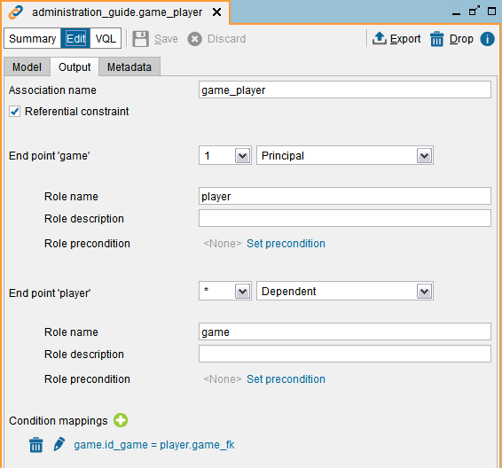

========================
GET_EXPORTED_KEYS
========================

.. rubric:: Description

The stored procedure ``GET_EXPORTED_KEYS`` returns the columns that are referenced by the foreign keys of other views (exported keys). Each row of the result represents a field of an exported key. This procedure is the *opposite* of :ref:`GET_FOREIGN_KEYS`.

A foreign key is a field (or collection of fields) of a view that uniquely identifies a row of another view or the same view. For example, if you have these views:

-  Order: the primary key is "id".
-  Order_details: the view has a field "order_id" whose value is the id of the order that it belongs to.

To define a foreign key with them, you have to create an association between "order" and "order_details":

-  The mapping has to be between the field "order_id" of "order_details" and "id" of "order".
-  Select the option *Referential constraint*. Otherwise, it is not considered a foreign key.
-  The end point "order" is the *Principal* and "player", the *Dependent*.
-  In the end point "order", the cardinality is 1. This means that a row of "order_details" can only refer to one row of "order".  

The section :doc:`Associations </vdp/administration/restful_architecture/associations/associations>` of the Administration Guide explains why they are useful and how to create them.

.. rubric:: Syntax

.. code-block:: bnf

   GET_EXPORTED_KEYS (
         input_database_name : text
       , input_view_name : text
   )

-  If you invoke the procedure using ``CALL`` and do not want to filter by a parameter, pass ``null``.

-  If ``input_database_name`` and ``input_view_name`` are ``null``, the procedure returns the referenced fields of all the views of all the databases.

-  If ``input_view_name`` is ``null``, the procedure returns the referenced fields of all the views of that database.

|

The procedure returns these fields:

-  ``pk_database_name``: name of database that the view of the primary key belongs to.
-  ``pk_view_name``: name of the view of the primary key.
-  ``pk_column_name``: name of the field that is part of the primary key.
-  ``pk_name``: name of the primary key.
-  ``fk_database_name``: name of database that the view of the foreign key belongs to.
-  ``fk_view_name``: name of the view of the foreign key.
-  ``fk_column_name``: name of the field that is part of the foreign key.
-  ``fk_name``: name of the association.

.. rubric:: Privileges Required

The results of this procedure change depending on the privileges granted to the user that runs it. If the user is not an administrator user, consider the following:

-  If the parameter ``input_database_name`` is not ``null``, the procedure returns an error if the user does not have CONNECT privileges over this database.
-  The procedure will only return information about the exported keys of a view when the user has ``EXECUTE`` privileges over that view and the view with the foreign key.

.. rubric:: Examples

Let us say that you have three views like in the figure below:

   
The figure below is the configuration of the association between the views "player" and "game":

.. rubric:: Example 1

.. code-block:: sql

   SELECT pk_view_name, pk_column_name, pk_name, fk_view_name, fk_column_name, fk_name
   FROM get_exported_keys()
   WHERE input_database_name = 'example'

.. csv-table:: 
   :header: "pk_view_name", "pk_column_name", "pk_name", "fk_view_name", "fk_column_name", "fk_name"
   
   "player", "id_player", "PRIMARY", "winner", "player_fk", "winner_player"
   "game", "id_game", "PRIMARY", "player", "game_fk", "game_player"
   
When you do not pass a value to the input parameter "input_view_name" or pass ``null``, the result of this procedure is the same as ``GET_FOREIGN_KEYS``.

.. rubric:: Example 2

.. code-block:: sql

   SELECT pk_view_name, pk_column_name, pk_name, fk_view_name, fk_column_name, fk_name
   FROM get_exported_keys()
   WHERE input_database_name = 'example' and input_view_name='game'

The result is:

.. csv-table:: 
   :header: "pk_view_name", "pk_column_name", "pk_name", "fk_view_name", "fk_column_name", "fk_name"
   
   "game", "id_game", "PRIMARY", "player", "game_fk", "game_player"

.. rubric:: Example 3
   
.. code-block:: sql

   SELECT pk_view_name, pk_column_name, pk_name, fk_view_name, fk_column_name, fk_name
   FROM get_exported_keys()
   WHERE input_database_name = 'example' and input_view_name='winner' 

This query does not return any row because there are not foreign keys that reference the view "winner".

See the example of the procedure :ref:`GET_FOREIGN_KEYS` to understand the difference between both procedures.  

